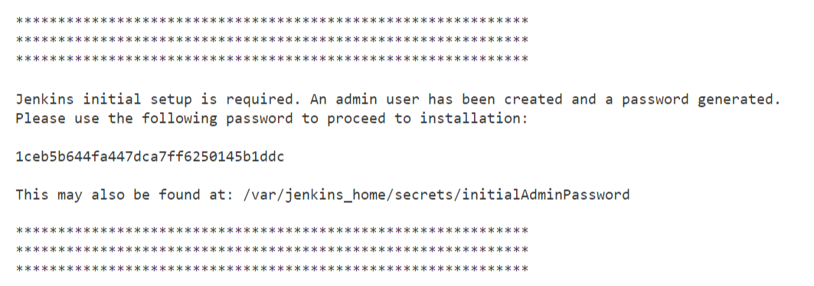
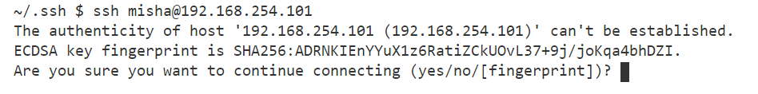
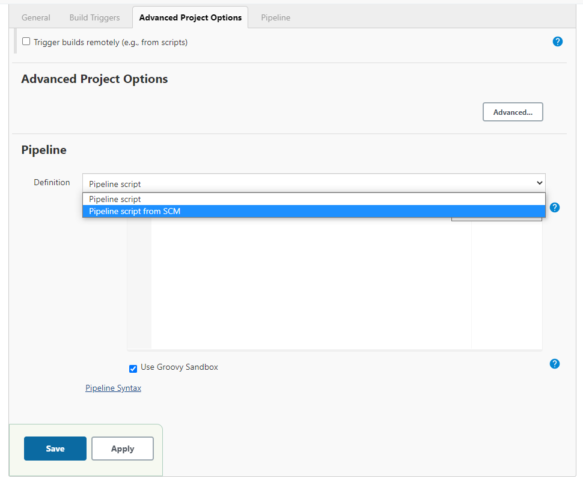
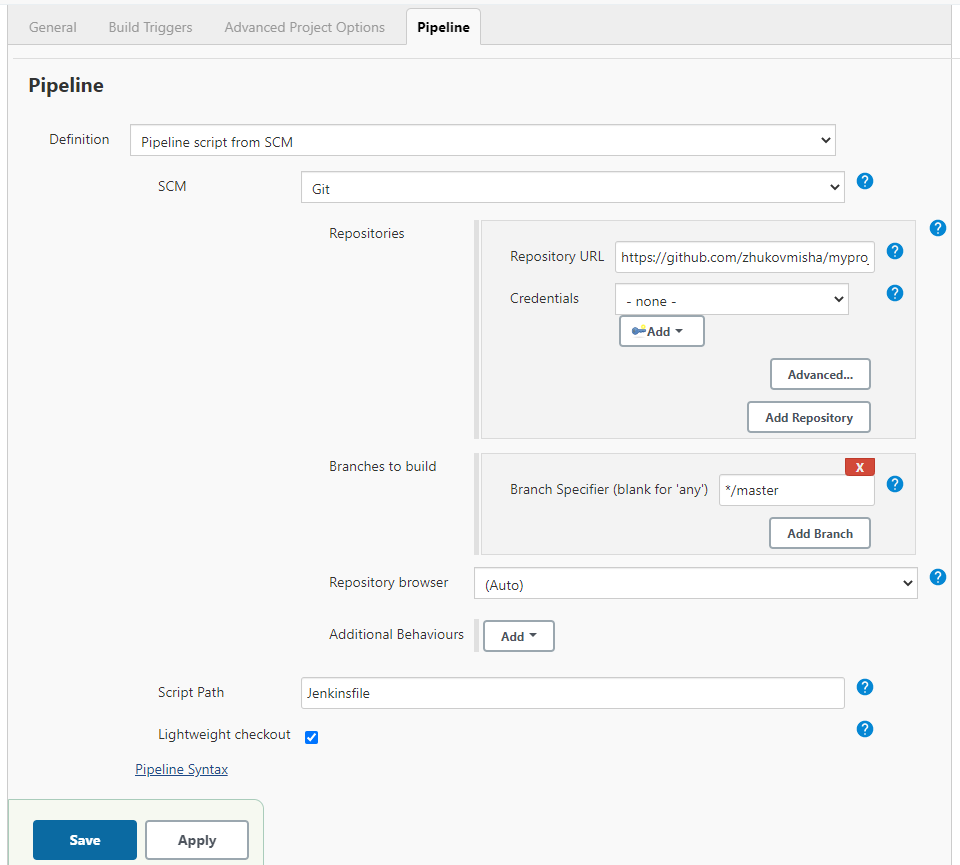
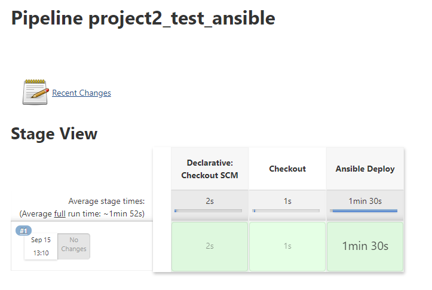

# Deploying a change to wordpress
Now that we have a web server it is time to deploy something to it.
One of the common deployments to wp is theme development.
## Jenkins setup
I assume you have CentOS 8.2

Install [Docker](https://docs.docker.com/engine/install/centos/)

Install [Docker Compose](https://docs.docker.com/compose/install/)

Create a home folder for Jenkins
```
mkdir ~/jenkins-data
cd jenkins-data
```

For this instance of Jenkins I am going to use Blue Ocean [info](https://www.jenkins.io/doc/book/blueocean/)

```
docker pull jenkinsci/blueocean
mkdir jenkins_home
sudo chown 1000:1000 jenkins_home/ -R
touch docker-compose.yml
mkdir pipeline
cd pipeline
touch Dockerfile
```
Add Docker into trusted zone
```
firewall-cmd --permanent --zone=trusted --change-interface=docker0
firewall-cmd --permanent --zone=trusted --add-port=4243/tcp
firewall-cmd --reload
```
Create
~/jenkins-data/pipeline/Dockerfile
```
FROM jenkinsci/blueocean

USER root

RUN echo "http://dl-cdn.alpinelinux.org/alpine/latest-stable/community" >> /etc/apk/repositories

RUN apk update

RUN apk add make

RUN apk add --no-cache --virtual .build-deps g++ python3-dev libffi-dev openssl-dev gcc libc-dev py-pip && \
    apk add --no-cache --update python3 && \
    pip3 install --upgrade pip setuptools


# Install ansible

RUN pip3 install ansible

RUN apk update && apk add --no-cache docker-cli

RUN pip install docker-compose

USER jenkins
```
Create ~/jenkins-data/docker-compose.yml
```
version: '3'
services:
  jenkins:
    container_name: jenkins
    image: jenkinsci/blueocean
    build:
      context: pipeline
    ports:
      - "8080:8080"
    volumes:
      - $PWD/jenkins_home:/var/jenkins_home
      - "/var/run/docker.sock:/var/run/docker.sock"
    networks:
      - net
networks:
  net:
```

Steps to build and run
```
docker-compose build
docker-compose up -d
```

Copy installation password from logs
```
docker logs jenkins
```


For Jenkins Pipeline we need to install the Ansible plugin.
Go to Manage Jenkins > Manage Plugins > Available > search Ansible.

Don't forget to connect to the target server inside the jenkins container via SSH for the first time manually.


## Creating a job
New Item > Enter an item name > Pipeline



Just copypaste the project's git url
```
https://github.com/zhukovmisha/myproject2_deploy_a_change
```


Save > Build Now

And that's it!


The deployment performed with a downtime of 1m 30s

## Technologies used
